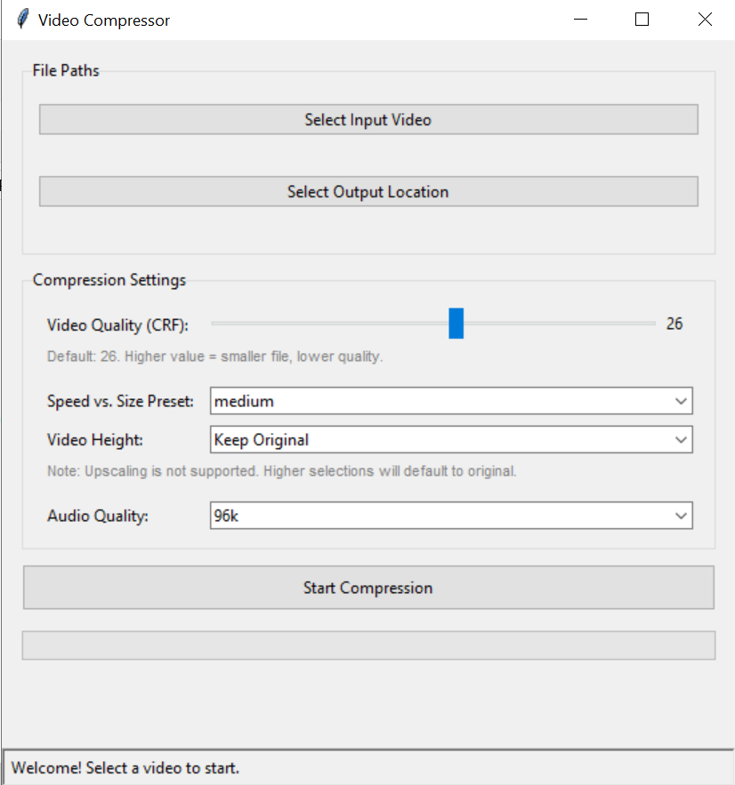

# Video Compressor GUI

A user-friendly desktop application for compressing video files with customizable settings, built with Python and FFmpeg.

---

## Key Features

* **Easy to Use:** A clean graphical interface for selecting files and settings.
* **Customizable Compression:** Adjust video quality (CRF), resolution, and audio bitrate.
* **Speed Control:** Choose from FFmpeg's encoding presets to balance speed and file size.
* **Standalone Application:** Packaged into a single executable that runs on Windows without needing Python or FFmpeg installed.

## Technologies Used

* **Python:** Core application logic.
* **Tkinter:** For the graphical user interface (GUI).
* **FFmpeg:** The powerful backend for all video and audio processing.

## How to Use

1.  Go to the [**Releases**](https://github.com/acoggins2022/Python-Video-Compressor/releases/tag/v1.0) page of this repository.
2.  Download the `VideoCompressor.exe` file from the latest release.
3.  Run the executable. No installation is needed!

---

*This is a personal project created to learn more about GUI development with Python and integrating command-line tools.*
